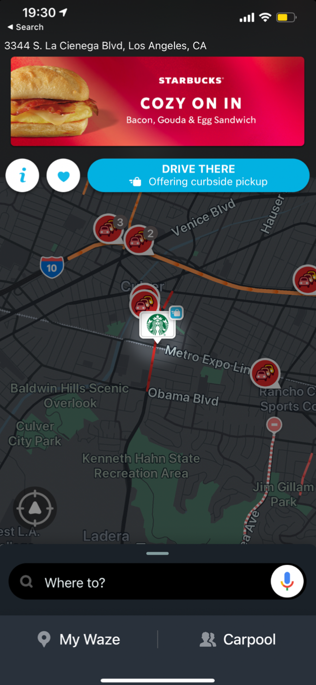

# Draft aplicativo

Conceito: Desenvolver um aplicativo que forneça às pessoas notícias em tempo real sobre
alertas de segurança pública ao seu redor.

## Como funcionaria o aplicativo:

## Features básicas:

- Geolocalização
- Diferentes tipos de alertas com informações sobre o alerta.
- Alertas com localização no mapa.
- Login, sistema de autenticação de email e telefone.
- Backend para curadoria jornalística e criação de alertas e notícias.
- Parte interativa para os usuários para reagir, comentar, e compartilhar nos alertas.
- Rating nível de segurança de bairros.
- Usuários podem criar alertas no mapa se passarem por um processo de autenticação.
- Adicionar contatos e ter acesso a localização deles.
- Feed de notícias (formato lista)
- Sistema de notificação.

## Cityzen

- Mapa com os alertas e distância do usuário. Clicando nos alertas pode se ver o que aconteceu no lugar, comentar, reagir, e compartilhar.
- Feed de notícias (formato lista)
- Notícias sobre segurança pública.

## Waze

- Os alertas do Waze são melhores porque mostram o tipo de alerta no ícone.
- Sistema de monetização do Waze, pouco invasivo mas presente no mapa.
- Referência de interface que o usuário pode acessar para criar um alerta.
  